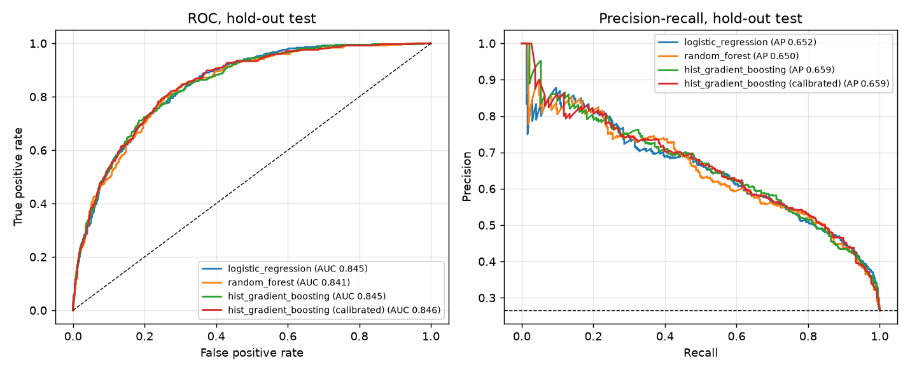
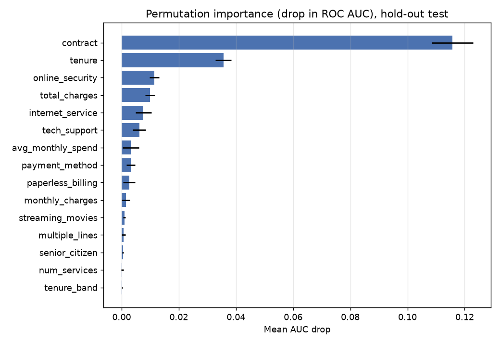
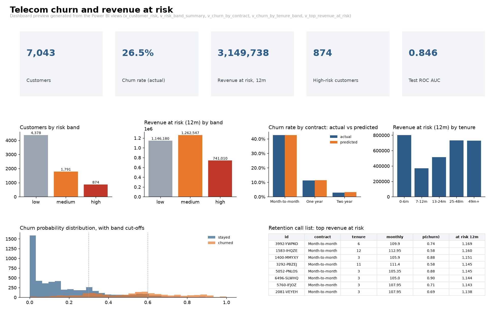

# Telecom churn and revenue-at-risk prediction

Predicts which telecom customers will churn next month and how much revenue that puts at risk over 12 months. Classic scikit-learn models with proper cross-validation, calibrated probabilities, a FastAPI scoring service, PostgreSQL views for a Power BI report, Docker Compose, CI, and a cloud deployment path on Azure Container Apps.

Dataset: IBM Telco Customer Churn, 7,043 customers, 26.5% churn rate. Publicly available, same shape as an operator's monthly customer snapshot.

## Results

Hold-out test set, 1,409 customers, 5-fold stratified cross-validation on the remaining 5,634. Threshold chosen on the training folds by maximising F1.

| Model | CV ROC AUC | CV PR AUC | Test ROC AUC | Test PR AUC | Test recall | Test precision | Brier |
|---|---|---|---|---|---|---|---|
| Logistic regression (baseline) | 0.847 ± 0.011 | 0.661 | 0.845 | 0.652 | 0.727 | 0.556 | 0.166 |
| Random forest | 0.845 ± 0.009 | 0.658 | 0.841 | 0.651 | 0.679 | 0.560 | 0.151 |
| Hist gradient boosting | 0.846 ± 0.010 | 0.662 | 0.845 | 0.659 | 0.709 | 0.581 | 0.163 |
| **Selected: HGB + isotonic calibration** | | | **0.846** | **0.659** | **0.701** | **0.566** | **0.135** |

Three honest observations:

- All three models sit at the same AUC. On this dataset the ceiling is around 0.85 and the signal is mostly in contract type and tenure. A more complex model does not buy anything; the gradient boosting model is selected on cross-validated PR AUC by a small margin.
- Calibration matters more than the model choice here. Isotonic calibration cuts the Brier score from 0.163 to 0.135, which is what makes the revenue numbers trustworthy.
- Recall of 0.70 at precision 0.57 is the operating point a retention team would actually use: catch seven in ten churners while roughly every second call is a real one.



### What drives churn

Permutation importance on the hold-out set (mean drop in ROC AUC when the column is shuffled):

| Feature | AUC drop |
|---|---|
| contract | 0.116 |
| tenure | 0.036 |
| online_security | 0.011 |
| total_charges | 0.010 |
| internet_service | 0.008 |
| tech_support | 0.006 |

Month-to-month contracts and short tenure dominate. Customers on fibre without security or support add-ons are the next segment.



### Revenue at risk

The dataset labels churn over one billing month, so the calibrated probability `p` is treated as a monthly hazard. Expected 12-month revenue is a geometric sum of monthly charges weighted by survival, and revenue at risk is the shortfall against a customer who stays:

```
expected_revenue_12m = monthly_charges * sum_{m=0}^{11} (1 - p)^m
revenue_at_risk_12m  = monthly_charges * 12 - expected_revenue_12m
```

| Metric | Value |
|---|---|
| Monthly revenue in the base | 456,117 |
| 12-month revenue at risk, all customers | 3,149,738 |
| High-risk customers (p ≥ 0.60) | 874 |
| 12-month revenue at risk in the high band | 741,010 |

The high band is 12% of customers and 24% of the revenue at risk, which is where a retention budget should go first.

### Dashboard

Preview drawn from the same SQL views the Power BI report uses (`python -m churn.dashboard_preview`). The Power BI layout and DAX measures are in [powerbi/README.md](powerbi/README.md).



## Project layout

```
src/churn/
  config.py      paths, feature lists, risk bands, DATABASE_URL
  data.py        load + clean the CSV, engineered features
  features.py    ColumnTransformer shared by every model
  train.py       CV, model selection, calibration, importance, scoring, figures
  revenue.py     expected revenue and revenue-at-risk formulas
  predict.py     inference used by the API
  db.py          load tables and views into PostgreSQL (or SQLite fallback)
  dashboard_preview.py  static preview of the Power BI pages from the views
api/main.py      FastAPI service: /predict, /predict/batch, /model, /health
sql/             reference schema and the Power BI views
powerbi/         how to build the report on top of the views, DAX measures
deploy/          Azure Container Apps deployment
tests/           data, formula and API tests
reports/         metrics.json, feature_importance.csv, figures
```

## Run it

```bash
pip install -r requirements.txt
export PYTHONPATH=src:.          # PowerShell: $env:PYTHONPATH="src;."

python -m churn.train            # ~20 s on a laptop, writes models/ and reports/
python -m churn.db               # SQLite in data/churn.db unless DATABASE_URL is set
pytest -q
uvicorn api.main:app --reload    # http://127.0.0.1:8000/docs
```

Score one customer:

```bash
curl -X POST http://127.0.0.1:8000/predict -H "Content-Type: application/json" -d '{
  "customer_id": "7590-VHVEG", "gender": "Female", "senior_citizen": 0, "partner": "Yes",
  "dependents": "No", "tenure": 1, "phone_service": "No", "multiple_lines": "No phone service",
  "internet_service": "DSL", "online_security": "No", "online_backup": "Yes",
  "device_protection": "No", "tech_support": "No", "streaming_tv": "No", "streaming_movies": "No",
  "contract": "Month-to-month", "paperless_billing": "Yes", "payment_method": "Electronic check",
  "monthly_charges": 29.85, "total_charges": 29.85 }'
```

```json
{"customer_id":"7590-VHVEG","churn_probability":0.6858,"churn_predicted":true,"risk_band":"high",
 "expected_revenue_12m":43.52,"revenue_at_risk_12m":314.68}
```

### With PostgreSQL and Docker

```bash
docker compose up --build
```

Starts Postgres, trains the model, loads the tables and views, then serves the API on port 8000. Connect Power BI to `localhost:5432`, database `churn`, user `churn`, password `churn`. See [powerbi/README.md](powerbi/README.md).

### Cloud

[deploy/azure.md](deploy/azure.md) deploys the API to Azure Container Apps and the database to Azure Database for PostgreSQL Flexible Server, both on the free or lowest tiers.

## Design decisions

- **Stratified split before anything else.** The test set is never touched until the final table. Threshold and calibration both come from the training folds.
- **Class weighting instead of resampling.** Balanced class weights keep every row and avoid leaking synthetic points across folds.
- **Model selected on PR AUC, not accuracy.** With 26% positives, accuracy rewards saying "no churn". PR AUC measures what matters: ranking churners at the top.
- **Calibrated probabilities.** A probability that is used in a revenue formula has to mean something. Isotonic calibration inside the CV loop gives the lowest Brier score of any variant.
- **Revenue is derived, not modelled.** With a single monthly snapshot there is no honest way to train a revenue regressor. The geometric-survival formula is explicit, testable, and easy to explain to a finance team.
- **Two database targets.** PostgreSQL for the real setup, SQLite when there is no Docker, so the whole pipeline still runs on a bare laptop and in CI.

## Limitations

- One snapshot, no time dimension. A production version would train on monthly snapshots and validate on the following month.
- The revenue formula assumes a constant monthly hazard. Real hazards fall with tenure.
- No usage or network data (call drops, data volume, complaints), which are usually the strongest churn signals an operator has.
